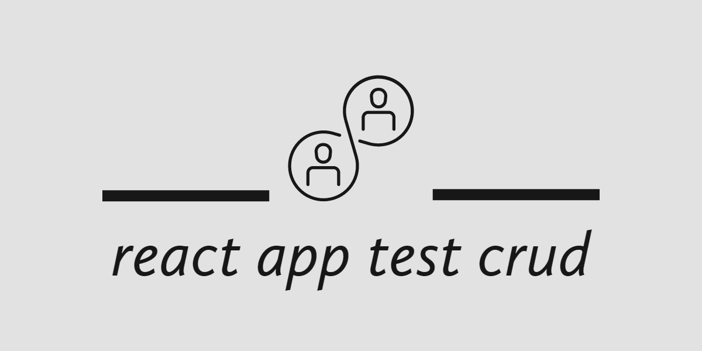
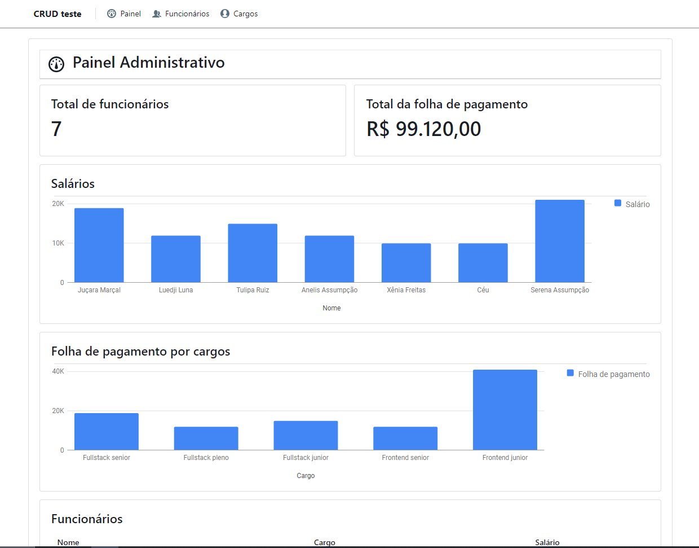
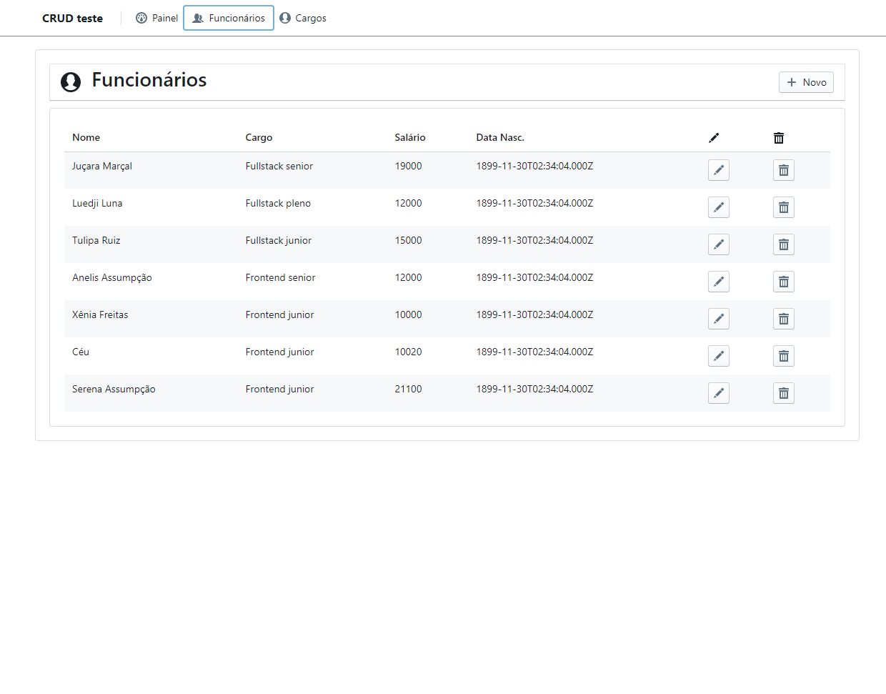

|     |  |     |
| --- | :-----------------------------: | --: |

<h1 align="center"><i>crud employees</i></h1>
<h3 align="center">A react app test crud.</h3>

|     | <p> . [About](#about) . [Folder Structures](#folder-structures) . [Libraries & Frameworks](#libraries-frameworks) . [Installation & Set Up](#installation-setup) . [Licence](#licence) . </p> |     |
| --- | :-------------------------------------------------------------------------------------------------------------------------------------------------------------------------------------------: | --: |

#### 1. About

This is a small project of crud created with nodejs, express, mysql in backend and react, blueprint in frontend.

# 



#### 2. Folder Structures

```bash
+--- front
     +--- public
     +--- src
          +--- AppContext
          +--- components
```

##

#### 3. Dev Libraries & Frameworks

| Name                                                    | Description                                                                                                     |
| ------------------------------------------------------- | --------------------------------------------------------------------------------------------------------------- |
| [React.js](https://reactjs.org/)                        | React.js is a free and open-source front-end JavaScript library for building user interfaces or UI components.. |
| [Axios](https://axios-http.com/)                        | Axios is a promise-based HTTP Client for node.js and the browser.                                               |
| [Blueprint](https://blueprintjs.com/)                   | Blueprint is an UI toolkit project open source, React-based.                                                    |
| [XAMPP](https://xampp.com/)                             | XAMPP is a completely free, easy to install Apache distribution containing MariaDB, PHP, and Perl.              |
| [HeidiSQL](https://www.heidisql.com/)                   | HeidiSQL is free software, and has the aim to be easy to learn.                                                 |
| [React Google Charts](https://react-google-charts.com/) | React Google Charts is a library to make a different charts, graphs and more analytics explanations.            |

##

#### 4. Installation & Set Up

\*_Require mySql db._

##### - Download & unpack project files

##### - Install project dependencies

```bash
  npm install or yarn install
```

##### - Run production mode

```bash
  npm start or yarn start
```

#### 4. License

MIT © [Johnson Sudré](https://github.com/johnsonsudre)
